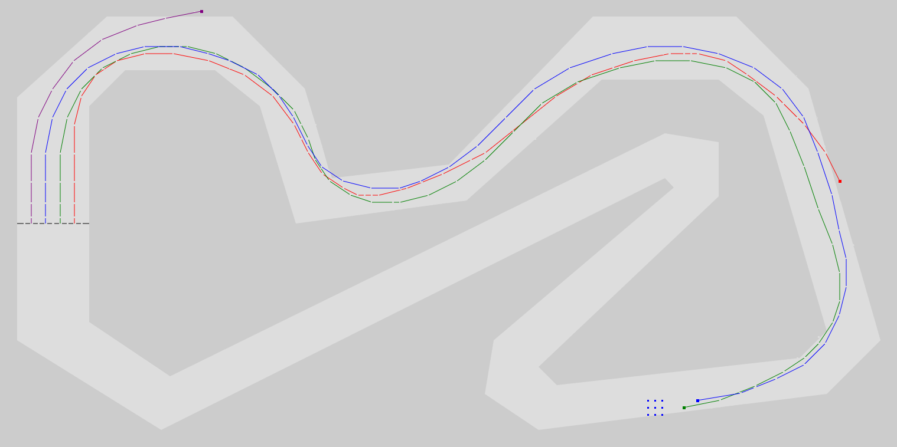

# Formula JS

Racing game inspired by the paper and pencil game from boomers' and gen X school days. No-frills implementation using only plain html/css and javascript.



## Installation

Download the `FormulaJS.zip` file from [here](download). Unzip the file and open `FormulaJS.html` in your favorite browser. Tested on Firefox, Chrome, and Edge.

## How to play

*Formula JS* is a simple but tricky simulation of sports car racing in which players try to pilot their racer along the circuit for one lap without crashing into other cars or going off the track.

Drivers take turns to make their next move. From their current position they choose one from a grid of nine allowed next positions that are determined by extrapolating from their previous position and speed.

Game play should be mostly self-explanatory. When it's your turn click one of the nine numbered buttons at the bottom of the screen or press the corresponding key to select the target position for your next move.

The all-time ranking shows the top ten drivers on each track. Drivers are ranked by the total lap time, then average speed, then top speed.

Note that the game only checks whether the racer positions are within the track. Therefore, it is possible for racers to cut corners or even "tunnel" through the track border if the space between adjacent track portions is narrow. 

## Adding new tracks

You can create your own race tracks by adding them in the [`formulaJSTracks.js`](src/formulaJSTracks.js) file. New tracks will be considered automatically in the track selection popup. For specifying race tracks this coordinate system is used:
```
    0            999
  0 ┼─────────────┤ x
    │             │
    │             │
    │             │
999 ┴─────────────┘
    y
```

To add a new race track:
- Create a new component of the `tracks` object. The component key must be an integer number forming a gapless progression with the other keys. Typically you would add your new track at the bottom and use the next integer as key.
- The new component must be an object with the following properties:
  - `name` - The name of the track. This will appear in the track selection drop down list. It will also be displayed at the top of the screen during races on that track.
  - `outer` - The outer border of the track. Must be an array of objects with `x` and `y` properties specifying the coordinates of a point on the outer track border.
  - `inner` - The inner border of the track. Must be an array of objects with `x` and `y` properties specifying the coordinates of a point on the inner track border.
  - `startFinish` - The start/finish line. Must be an array of two objects with  `x` and `y` properties specifying the endpoints of the start/finish line (must be horizontal or vertical!). If the start/finish line is oriented left-to-right the race goes up from there, otherwise it starts going down. If it is oriented top-to-bottom the race goes right from there, otherwise it starts going left.
